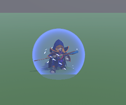

# Wizard VS Dragon

**Hadapi Amarah Naga Perkasa dengan Kekuatan Sihir di Tanganmu!**

Selamat datang di dunia "Wizard VS Dragon", sebuah game pertarungan magis yang imersif di mana takdir dunia bergantung pada keberanian dan kekuatanmu. Kendalikan seorang penyihir perkasa dan hadapi naga legendaris dalam pertempuran hidup dan mati!

---

## Skenario: Sang Penjaga Terakhir

Di negeri yang damai, seekor naga kuno yang telah lama tertidur kini telah bangkit, membawa api dan kehancuran. Kota-kota menjadi abu dan harapan mulai sirna. Di tengah keputusasaan, berdirilah seorang penyihir—penjaga terakhir dari pengetahuan sihir kuno. Dengan tongkat di tangan dan keberanian di hati, sang penyihir melangkah maju untuk menantang sang naga, memulai duel epik yang akan menentukan nasib dunia.

## Fitur Utama

*   __Kontroler Gerak Interaktif:__ Rasakan setiap mantra yang kamu rapalkan! Dengan kontroler gerak yang responsif, kamu bisa mengayunkan tanganmu untuk meluncurkan bola api atau mengangkat perisai pelindung secara intuitif.

*   __Gudang Sihir Mematikan:__ Kuasai elemen-elemen alam untuk mengalahkan musuhmu.
    *   **Serangan (Spell Attacking):**
        *   🔥 **Api:** Bakar sisik naga dengan bola api yang menyala-nyala.
        *   ❄️ **Es:** Bekukan gerakannya dengan ledakan es yang menusuk.
        *   ⚡ **Petir:** Guncang langit dan kejutkan sang naga dengan petir yang dahsyat.
        *   🗿 **Batu:** Hantam musuhmu dengan batu-batu raksasa yang ditarik dari dalam bumi.

    *   **Pertahanan (Spell Defend - Shift):**
        *   🛡️ **Perisai Pelindung:** Saat naga menyemburkan api, aktifkan perisai sihirmu untuk menahan serangan mematikan dan mencari celah untuk menyerang balik!

## Requirements

*   Windows 64-bit

## Download

[Download Wizard VS Dragon](https://github.com/Lelegoyeng/Wizard-VS-Dragon-Review/releases/tag/Exe)

---

Apakah kamu siap untuk menjadi legenda? Mainkan "Wizard VS Dragon" dan buktikan kekuatan sihirmu!
